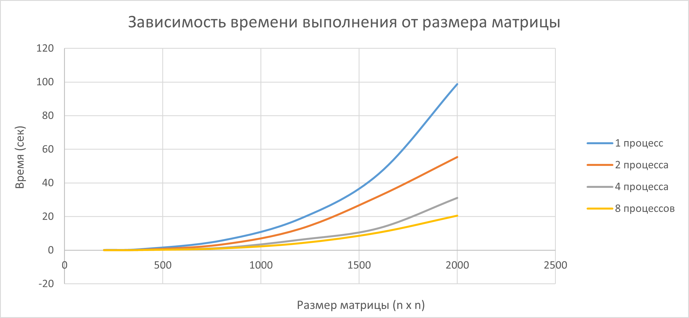

# Отчет по лабораторной работе №3

В ходе выполнения работы была модифицирована программа из л/р Nº1 для паралельной работы по технологии МРІ. Для этого была разработана отдельная функция `multiply_mpi`, которая реализует параллельное умножение матриц с использованием технологии MPI. 

Была проведена серия экспериментов для матриц разного размера: 200х200, 400х400, 800х800, 1200х1200, 1600х1600 и 2000х2000. Матрицы содержат числа от 0 до 100. 
Также менялось количество процессов: 1, 2, 4, 8. Для каждого размера матрицы и каждого количества процессов измерялось время выполнения умножения. Результаты представлены в директории `results`, а также визуализированы на графике на графике зависисмости времени выполнения от размера графика:

## Вывод
При увеличении количества процессов наблюдается снижение времени выполнения. Для маленьких матриц увеличение количества процессов почти не даёт выигрыша во времени выполнения. Но MPI-реализация умножения матриц показывает хорошие результаты для больших задач. Чем больше размер матрицы, тем эффективнее работают несколько процессов.
