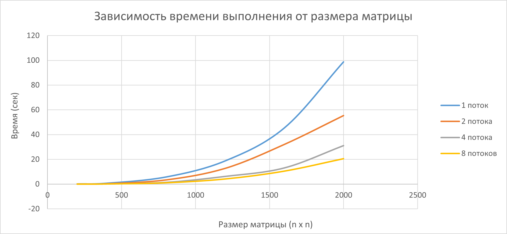

# Отчет по лабораторной работе №2
В ходе лабораторной работы была модифицирована программа из лабораторной работы №1 для 
параллельного умножения квадратных матриц по технологии OpenMP. Для этого в перегрузку оператора умножения была добавлена директива `#pragma omp parallel for`.
Управление количеством потоков осуществляется с помощью функции `omp_set_num_threads()`.

Была проведена серия экспериментов для матриц разного размера: 200х200, 400х400, 800х800, 1200х1200, 1600х1600 и 2000х2000. Матрицы содержат числа от 0 до 100. 
Также менялось количество потоков: 1, 2, 4, 8, 12. Для каждого размера матрицы и каждого количества потоков измерялось время выполнения умножения.
Результаты представлены в директории `results`, а также визуализированы на графике на графике зависисмости времени выполнения от размера графика: 

Для верификации результатов был написан скрипт на языке Python. Программа выполняет умножение матриц с помощью вторенной библиотеки NumPy, 
сравнивает результаты и записывает их в отдельный файл `verify_results.txt`. 
Для каждого размера матрицы результаты, полученные с помощью программы на C++, совпали c результатами, полученными с помощью программы на Python.

# Вывод
Результаты экспериментов показали, что версия программы с использованием технологии OpenMP работает корректно и позволяет ускорить вычисления. 
Наибольший эффект от использования нескольких потоков достигается при обработке больших матриц, где вычислительная нагрузка значительна.
