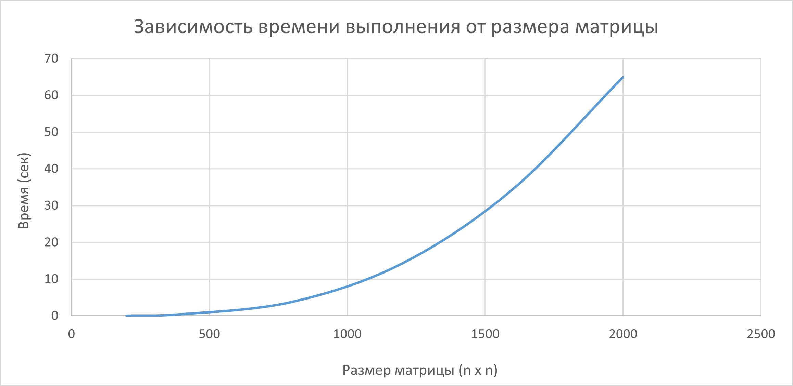

# Отчет по лабораторной работе №1
В ходе выполнения лабораторной работы был создан класс Matrix на языке C++. 
Для умножения матриц был перегружен оператор *. Для тестирования производительности были осуществлены замеры времени выполнения операции умножения
для матриц разного размера: 200х200, 400х400, 800х800, 1200х1200, 1600х1600 и 2000х2000. Матрицы содержат числа от 0 до 100. 
Результаты представлены в файле `results.txt`, а также визуализированы на графике зависисмости времени выполнения от размера графика:

График подтверждает, что алгоритм умножения матриц имеет сложность O(n^3).

Для верификации результатов был написан скрипт на языке Python. Программа выполняет умножение матриц с помощью вторенной библиотеки NumPy,
сравнивает результаты и записывает их в отдельный файл `verify_results.txt`. Для каждого размера матрицы результаты, полученные с помощью программы на C++,
совпали c результатами, полученными с помощью программы на Python.
