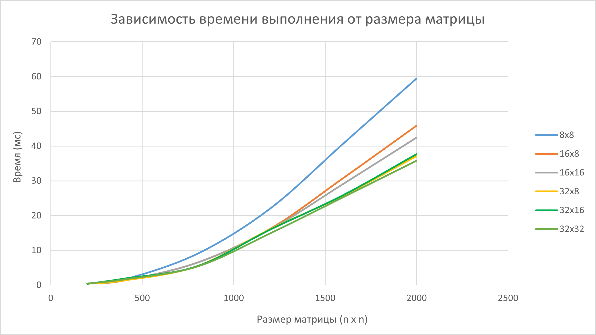

# Отчет по лабораторной работе №5
В ходе выполнения лабораторной работы параллельная версия программы на MPI была запущена на суперкомпьютере «Сергей Королёв» с разным количеством процессов: 1, 2, 4, 8.

Исходный код был загружен на суперкомпьютер «Сергей Королёв» и скомпилирован командой:

`mpicxx -std=c++11 -o mpi matrix_mpi.cpp`

Скрипт для запуска находится в файле `start.pbs`. Результаты представлены в директории `results`, а также визуализированы на графике зависисмости времени выполнения от размера графика:

| Размер | 1 процесс | 2 процесса | 4 процесса | 8 процессов |
|--------|-----------|------------|------------|--------------|
| 200    | 0.05468    | 0.03883    | 0.02096    | 0.01238      |
| 400    | 0.35989    | 0.18184    | 0.09285    | 0.07163      |
| 800    | 3.02792    | 1.53544    | 0.78155    | 0.40946      |
| 1200   | 10.33133   | 5.17390    | 2.60547    | 1.31803      |
| 1600   | 24.37122   | 12.21099   | 6.15447    | 3.20585      |
| 2000   | 47.40721   | 23.84527   | 12.37851   | 6.42117      |

# Вывод
В ходе работы была подтверждена работоспособность MPI-программы на суперкомпьютере «Сергей Королёв». MPI-реализация умножения матриц показывает хорошие результаты для больших задач. Чем больше размер матрицы, тем эффективнее работают несколько процессов.
